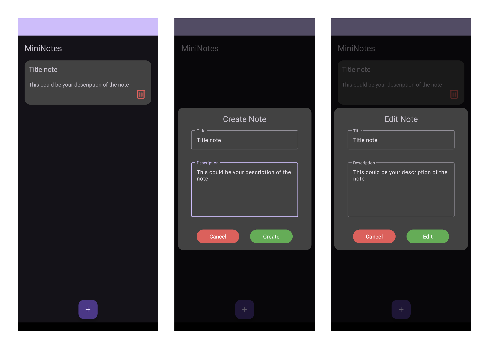

# MiniNotes

This is a small application for creating and storing notes.

## Instruction

In order to run this application on your phone you can use the **Releases tab** where the apk file is located. You can install it on your phone and start using the application.

You can also build the apk manually, for this you need to clone this repository locally on your computer and open the project in **Android Studio**, then build your apk.

## Application functionality

The app has features such as:
- View notes
- Creating notes
- Edit notes
- Deleting notes

All notes are stored locally.
